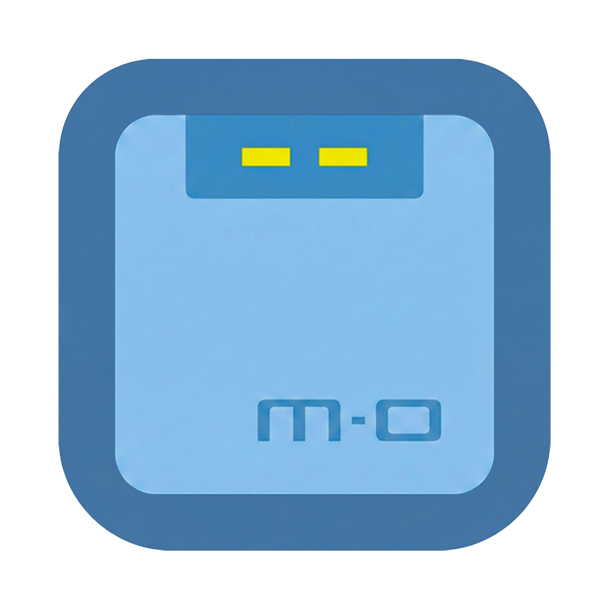
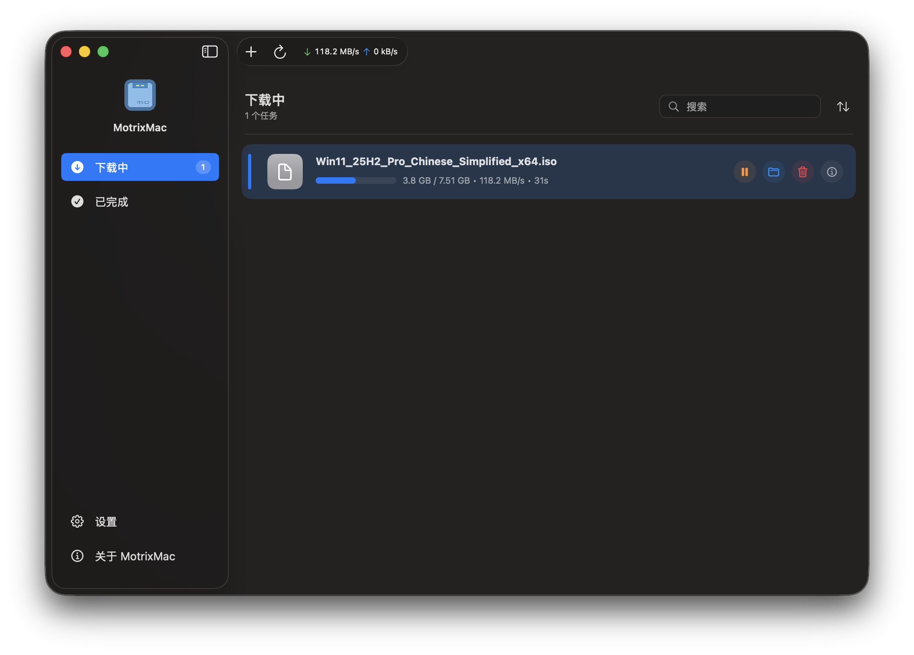
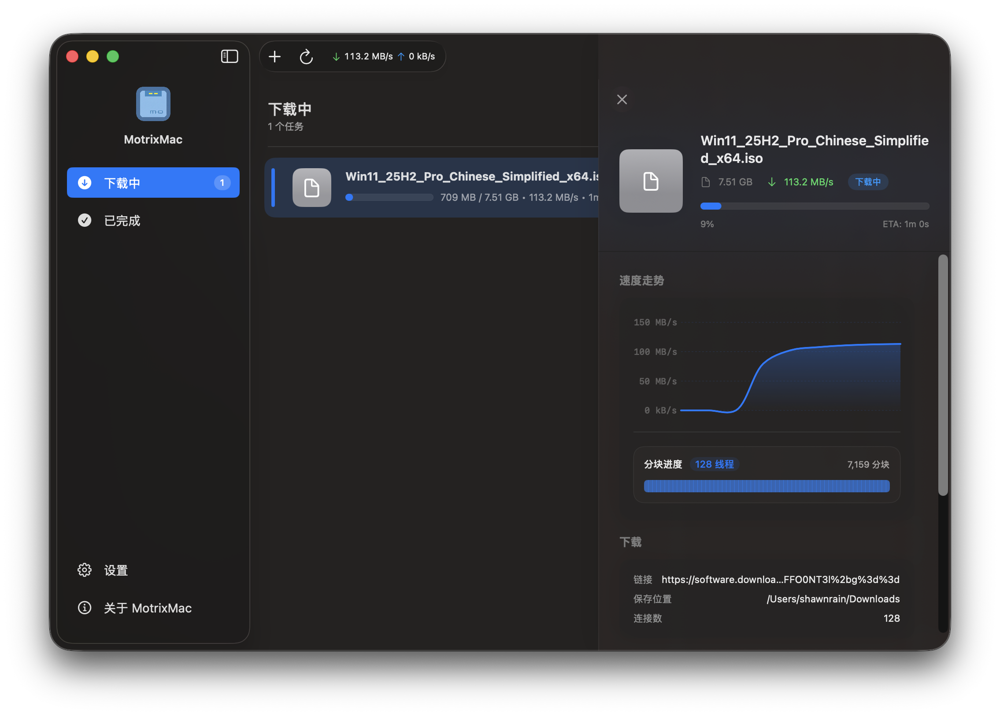
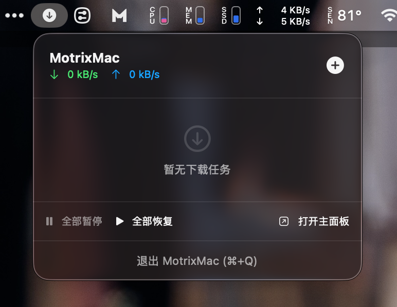

# MotrixMac

> This is a vibe-coded project.
> 使用 **Antigravity** 倾情开发。

<p align="center">
  
</p>

## 一个轻量化的、全原生 Swift 实现的 macOS 下载工具。

[English](./README.md) | 简体中文

## 为什么要开发 MotrixMac？

原版的 [Motrix](https://github.com/agalwood/Motrix) 已经很长时间没有更新了，但我非常喜欢它的简洁设计。为了在 macOS 上获得更好的使用体验，我决定使用 **Swift** 和 **SwiftUI** 从零开始重写一个全原生的版本。

MotrixMac 旨在为现代 macOS 生态系统提供一个极速、轻量且具备原生质感的下载工具，让下载体验更系统，更纯粹。

MotrixMac 是一款使用 SwiftUI 构建的 macOS 原生下载管理器，旨在提供极速、高效且卓越的用户体验。它在保留原版 Motrix 精髓的同时，带来了真正的原生系统触感。

## ✨ 特性

- 🕹 **纯原生实现**：使用 Swift 和 SwiftUI 构建，拥有最佳性能和系统集成度。
- 🦄 **全能支持**：支持下载 HTTP、FTP、BitTorrent 以及磁力链接。
- 📡 **自动更新 Tracker**：每天自动更新 Tracker 列表，提升 BT 连接速度。
- 🚀 **极致性能**：单任务最高支持 128 线程，实现飞速下载。
- 🔌 **无缝连接**：内置 UPnP 和 NAT-PMP 端口映射支持。
- 🌍 **浏览器集成**：配备功能强大的浏览器插件，支持 Chrome 和 Edge。
- 🌑 **现代界面**：完美支持深色模式，拥有优雅的「Liquid Glass」UI 设计。
- 🗑 **智能管理**：移除任务时支持可选的关联文件删除。

## 🖥 应用截图





## ⌨️ 开发指南

### 环境准备

1. 克隆代码库：
   ```bash
   git clone https://github.com/ShawnRn/MotrixMac.git
   ```
2. 使用 Xcode 打开 `MotrixMac.xcodeproj`（需要 macOS 14+ 和 Xcode 15+）。
3. 直接编译并运行。

### 浏览器插件

插件源码位于 `MotrixMac-Webextension` 目录。
编译插件请运行：
```bash
cd MotrixMac-Webextension
yarn install
npm run build -- chrome
```

## 📜 鸣谢

- 灵感来源于 [Motrix](https://github.com/agalwood/Motrix).
- 核心下载引擎 [aria2](https://aria2.github.io/).
- 浏览器插件基于 [motrix-webextension](https://github.com/gautamkrishnar/motrix-webextension).
- 使用 [Antigravity](https://antigravity.google/) 开发 —— 谷歌 DeepMind 推出的强大 AI 编程助手。

## 📜 开源协议

[MIT](https://opensource.org/license/MIT) Copyright (c) 2026 Shawn Rain.
